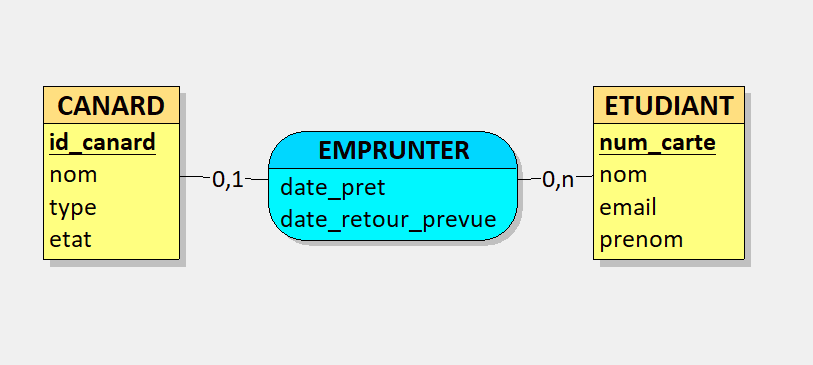
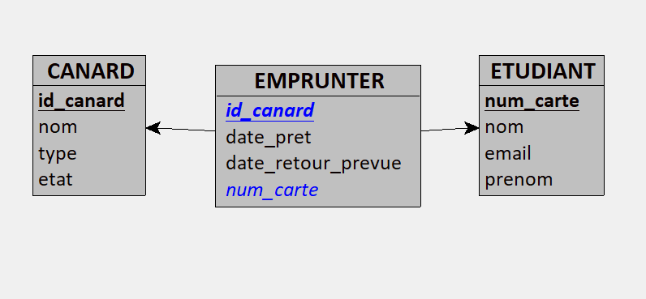

# 🦆 Mini-Projet : La Canardothèque

Ce projet est une application intranet développée en **PHP/PDO** suivant l'architecture **MVC**. Elle permet au **Club Coin-Coin** de gérer son inventaire de canards (en plastique, peluches, bouées) et le suivi des adoptions par les étudiants du campus.

---

## 👤 Informations Étudiant
* **Nom :** Ch
* **Prénom :** Ali

---

## 🚀 Installation et Lancement

### 1. Configuration de la Base de Données
* **Nom de la base :** `la_canardotheque`
* **Instance MySQL :** Configurée sur le **Port 3307**.
* **Importation :** 1. Créez la base de données `la_canardotheque` via MySQL Workbench ou PhpStorm.
    2. Importez et exécutez le fichier `database.sql` situé à la racine du projet pour générer les tables (`canard`, `etudiant`, `emprunter`) et les données de test.

### 2. Accès au projet
Assurez-vous que votre serveur local (Apache) est actif. L'URL d'accès est :
`http://localhost/MiniProjetLaCanardotheque/index.php`

---

## ✅ Ce qui fonctionne (Fonctionnalités)

### A. Gestion des Canards
* **Listing :** Affichage dynamique de tous les canards avec leur nom, type et état actuel.
* **Ajout :** Formulaire permettant d'ajouter un nouveau canard (type ENUM : Plastique, Peluche, Bouée).

### B. Gestion des Étudiants
* **Listing :** Affichage de la liste des étudiants inscrits.
* **Ajout :** Enregistrement de nouveaux étudiants avec numéro de carte, nom, prénom et email.

### C. Gestion des Emprunts (Adoptions)
* **Adoption :** Formulaire liant un canard disponible à un étudiant avec une date de retour prévue.
* **Mise à jour automatique :** Lors d'un emprunt, l'état du canard passe automatiquement de `Dans la mare` à `En vadrouille` en base de données.

---

## 🛡️ Sécurité Implémentée
* **Injections SQL :** Utilisation systématique de requêtes préparées (`$pdo->prepare()` + `$stmt->execute()`) pour toutes les données provenant des formulaires (`$_POST`).
* **Failles XSS :** Protection de l'affichage HTML via la fonction `htmlspecialchars()` pour chaque donnée issue de la base de données.

---

## 📂 Architecture Technique
Le projet respecte une structure **MVC** pour une meilleure maintenance :
* `models/` : Logique de données (Requêtes SQL).
* `controllers/` : Logique métier (Lien entre Modèle et Vue).
* `views/` : Présentation (Fichiers HTML/PHP).
* `config/db.php` : Connexion PDO centralisée.

## 🏗️ Modélisation (MCD)
Voici le Modèle Conceptuel de Données réalisé pour la Canardothèque :

## 📐 Modèle Logique de Données (MLD)

Le passage du modèle conceptuel au modèle logique a permis de définir la structure exacte des tables et les relations (clés étrangères) :

### Détails des Tables :
* **CANARD** : `id_canard` (PK), nom, type, etat.
* **ETUDIANT** : `num_carte` (PK), nom, prenom, email.
* **EMPRUNTER** : `id_emprunt` (PK), #id_canard (FK), #num_carte (FK), date_pret, date_retour_prevue.
